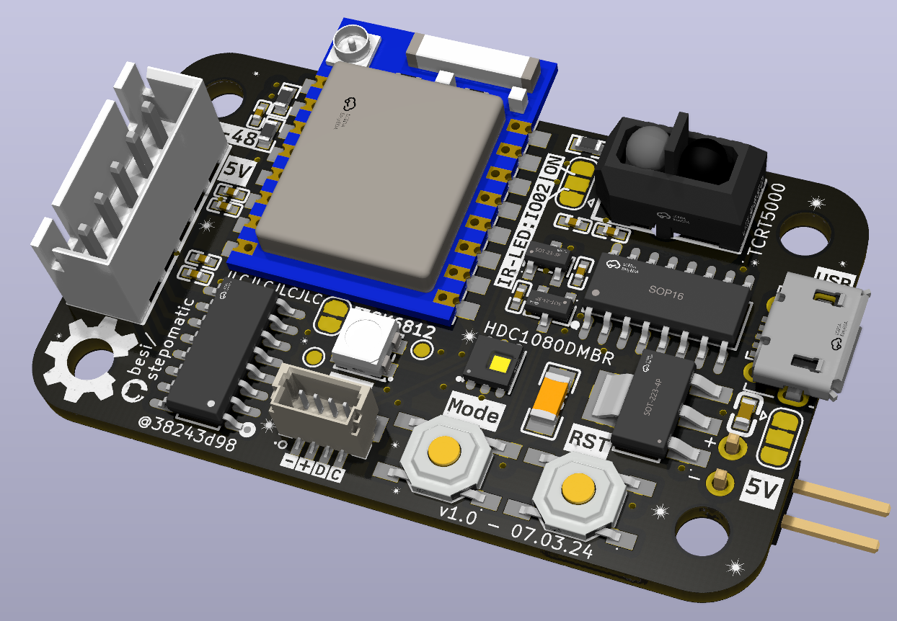

# Stepomatic

## JLC Componennts

    # Put this in your ~/.zshrc or ~/.bashrc
    alias jlc='JLC2KiCadLib -dir lib'
    
    # Now the following will download kicad symbols, footprints and 3d models
    jlc C82227

# Acknoledgements

- Special thanks to Valentyna M. for designing the pcb artwork.
- The free font [Dexotick](https://www.behance.net/dhanstudio) was used for the pcb artwork.
- [JLC2KiCadLib](https://pypi.org/project/JLC2KiCadLib) was used for downloading the footprints for the LCSC footprints
